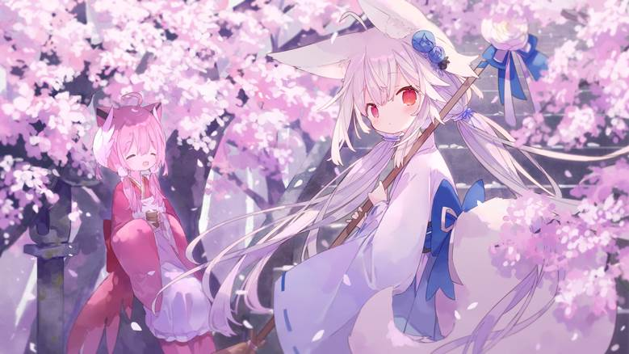

----

     
    <h3>云 冰 祈</h3>
    
冰祈原形象取自HY老师的 樱田诗露 

     
    
若您在使用过程中发现了bug或有一些建议，欢迎提出ISSUE、PR或加入 <a href="https://jq.qq.com/?_wv=1027&k=P2RLYegh">QQ交流群：878268637</a> 

     
    
 <a href="https://gitee.com/koinori/Icepray/raw/master/res/vx.jpg">欢迎老板打赏小鱼干喵~

     
    
<s>来个star吧，球球惹！</s>

# KoinoriBot Plugins

基于Yunzai-Bot的冰祈插件集合  

## 功能介绍

冰祈是一个多功能娱乐型群聊机器人，功能具体请移步 [使用指南](https://www.lanxy.ink/?p=476)

  
仓库内部分功能一览

- **每日签到**：`icelogin`
- **更换称呼**：`call_me_please`
- **碧蓝档案**：查询学生资料，抽卡模拟器 `ba_wiki`
- **冰祈与鱼**：钓鱼与漂流瓶二合一 `fishing`
- **随机美图**：`sinaimg`
- 更多功能可查看使用指南

## 使用方法

> - 在Yunzai根目录执行
> 
> 
> - git clone --depth=1 https://gitee.com/xiaoye12123/ws-plugin.git ./plugins/ws-plugin/
> 
>
> - 加入云冰祈授权群获得使用权
>
>
> - 将申请得到的特殊配置文件全部覆盖至Yunzai-Bot/plugins/ws-plugin/config/config

 
 关于如何安装Yunzai 
 

- 仓库传送门 [Miao-Yunzai](https://gitee.com/yoimiya-kokomi/Miao-Yunzai） (作者： [yoimiya-kokomi](https://gitee.com/yoimiya-kokomi/))

## 免责声明 

1.功能仅限内部交流与小范围使用， 请勿将Yunzai-Bot及云冰祈(Cloud-Icepray)用于以盈利为目的场景
 
2.头像及表情包来自HY的原创角色「桜田シロ(樱田诗露)」，感谢HY桑的辛勤付出以及设计出来的可爱小狐狸，个人链接[在这里](https://blog.kiseki.moe/)(可能需要连接代理)，HY推特：[@hy_plus](https://twitter.com/hy_plus)。(需要代理)

3.头像原图片来自pixiv，画师：[あみみ](https://twitter.com/mdenamimi)，原图片[在这里](https://www.pixiv.net/member_illust.php?mode=medium&illust_id=90559521)。(需要代理)

4.指南banner来自pixiv，画师：[水々](https://twitter.com/Phoenix1237)，原图片[在这里](https://www.pixiv.net/artworks/89164923)。(需要代理)

5.戳一戳表情包&签到背景来自画师：[しらたま](https://twitter.com/shiratamacaron)的「[星空鉄道とシロの旅](http://shiratamaco.com/)(星空列车与白的旅行)」中的角色。しらたま老师已入驻B站，个人主页[在这里](https://space.bilibili.com/1296113267?from=search&seid=17809059914527246779&spm_id_from=333.337.0.0)。

6.部分表情包来自Line贴图，画师：[ピロリ菌](https://twitter.com/heripiro)。(需要代理)